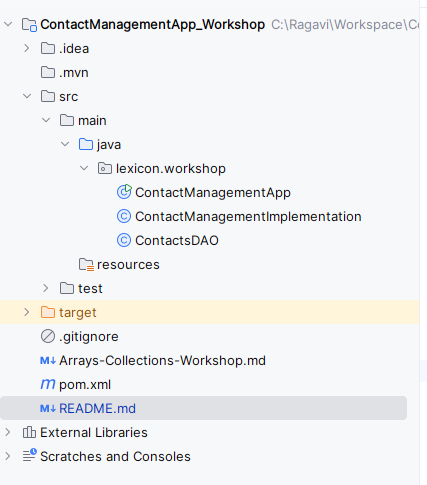
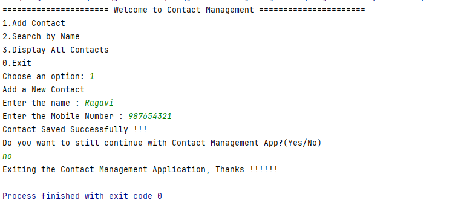

# Contact Management Application

This application is a console-based Java application that manages contacts stored in the following format: name|mobile. 
It has operations such as adding, searching and listing contacts.

## Structure of the Project:

This Project is designed by seperating the layers in each class.
The console menu and main method, which is the direction of the project, is in ContactManagementApp class.
The core logic, about add, search and listing contacts are in ContactManagementImplementation.
The variables are defined in DAO class and generetaed getters and setters for multiple calls, in ContactsDAO.

## Display in Console

This is how the output is displayed in the console.

